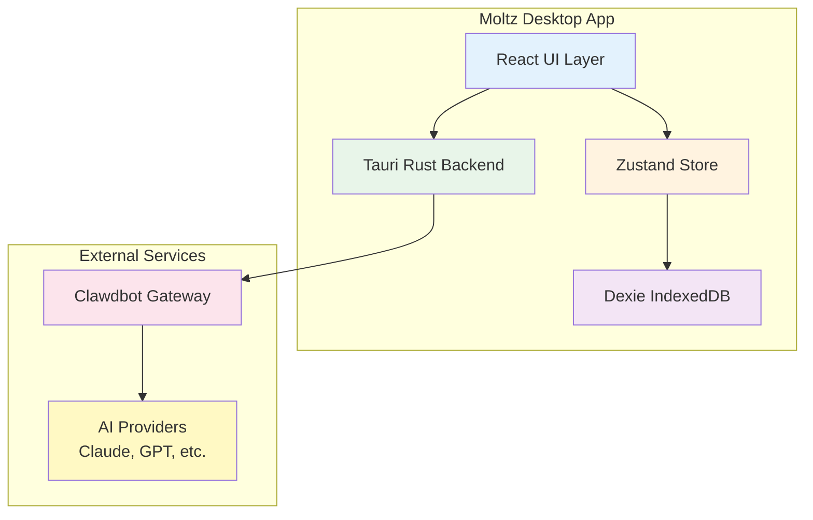
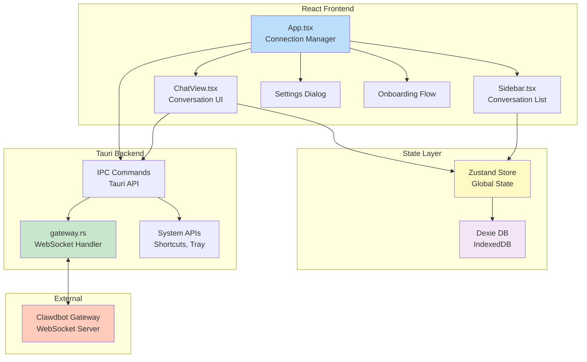
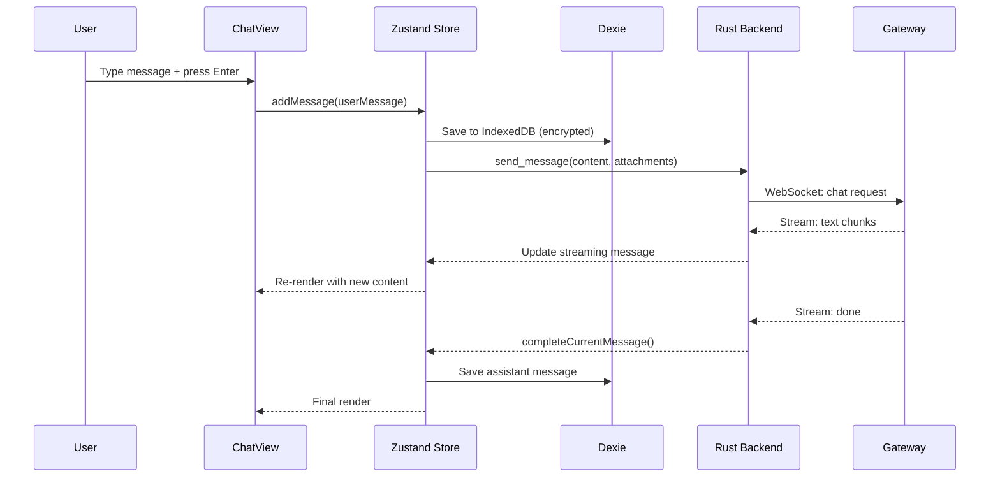
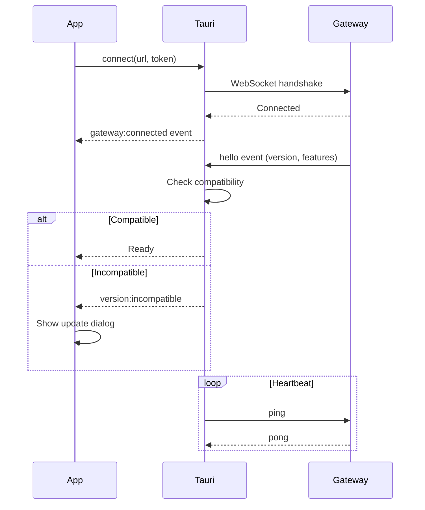
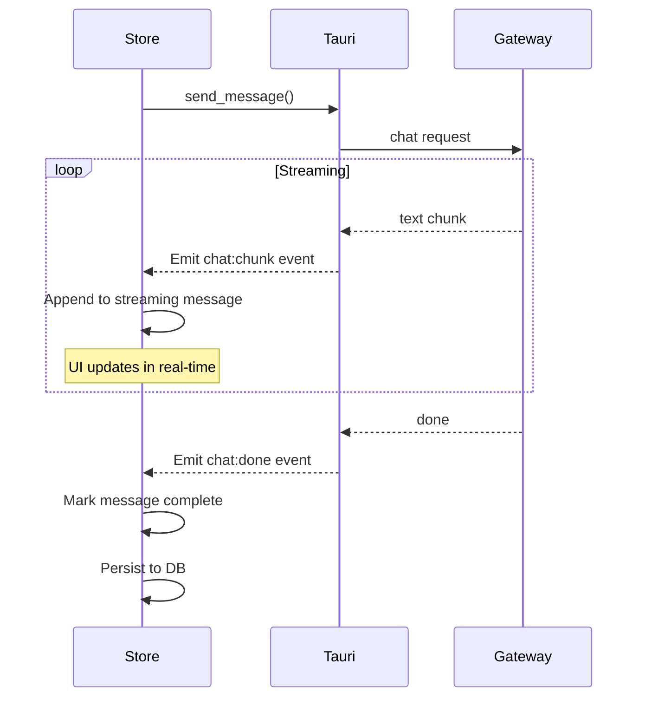
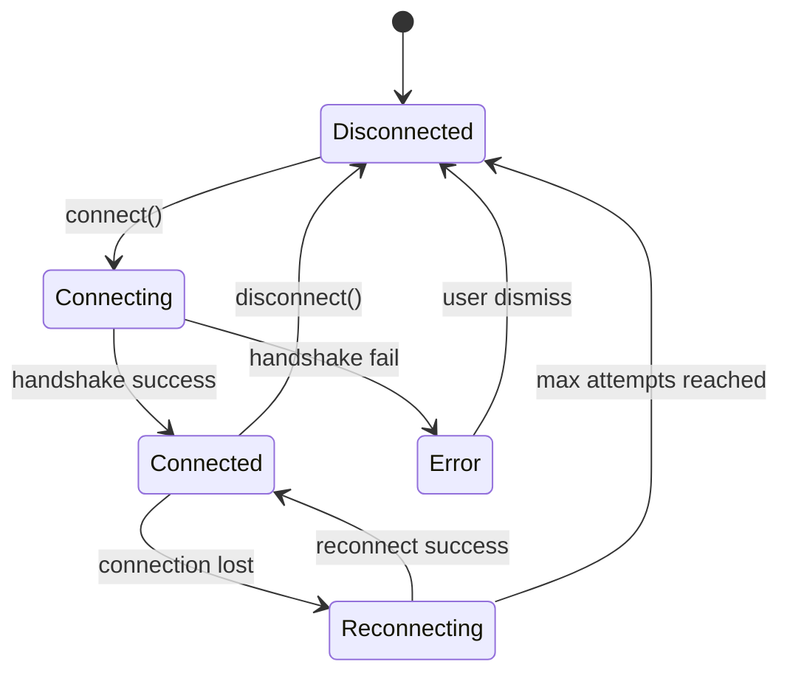
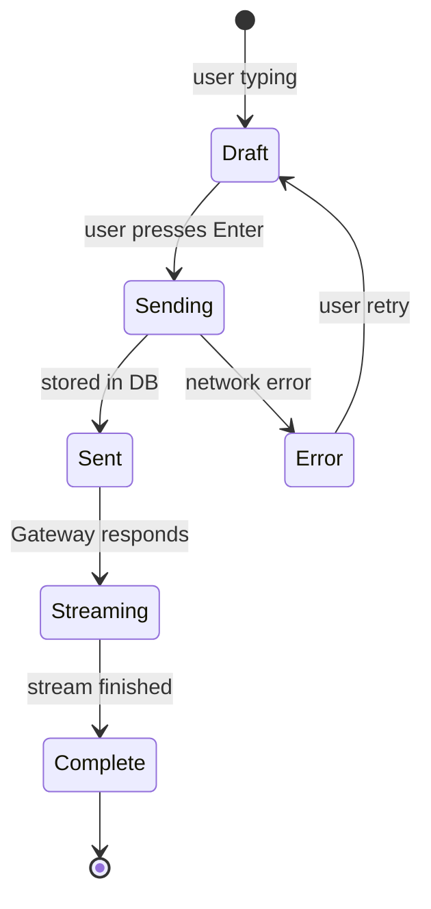
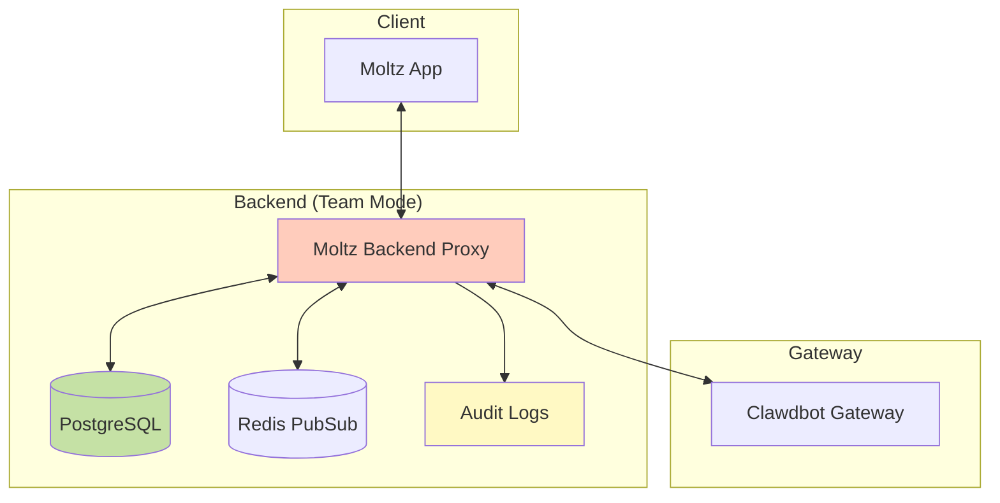

# Moltz Architecture

This document describes the technical architecture of Moltz, including system components, data flow, and design decisions.

**For non-developers:** This is technical documentation for contributors and curious users. If you just want to use Moltz, check out the [User Guide](./User-Guide.md) instead.

**Note:** This documentation includes Mermaid diagrams. View on GitHub or in a Mermaid-compatible markdown viewer for the best experience.

---

## TL;DR for Developers

**Stack:**
- Frontend: React 18 + TypeScript + Vite
- Backend: Rust + Tauri 2.0
- State: Zustand
- Database: Dexie (IndexedDB)
- UI: Radix UI + Tailwind CSS
- Protocol: WebSocket to Clawdbot Gateway

**Why these choices?** Speed, security, and developer experience. See [Design Decisions](#design-decisions) for details.

---

## Table of Contents

1. [System Overview](#system-overview)
2. [Architecture Layers](#architecture-layers)
3. [Component Diagram](#component-diagram)
4. [Data Flow](#data-flow)
5. [State Management](#state-management)
6. [IPC Communication](#ipc-communication)
7. [Gateway Protocol](#gateway-protocol)
8. [Security Architecture](#security-architecture)
9. [Performance Optimizations](#performance-optimizations)

---

## System Overview

Moltz is built using:

- **Frontend:** React 18 + TypeScript + Vite
- **Backend:** Rust + Tauri 2.0
- **State Management:** Zustand
- **Database:** Dexie (IndexedDB wrapper)
- **UI Components:** Radix UI + Tailwind CSS
- **Protocol:** WebSocket-based Gateway protocol



---

## Architecture Layers

### 1. Presentation Layer (React)

**Location:** `src/components/`, `src/pages/`

**Responsibilities:**
- Render UI components
- Handle user interactions
- Display conversation messages
- Manage local UI state (modals, animations)

**Key Components:**
- `App.tsx` — Root component, connection management
- `ChatView.tsx` — Main conversation interface
- `Sidebar.tsx` — Conversation list with virtualization
- `MessageBubble.tsx` — Individual message rendering
- `MarkdownRenderer.tsx` — Markdown + syntax highlighting

**Technology:**
- React 18 (hooks, concurrent features)
- Radix UI (accessible primitives)
- Tailwind CSS (utility-first styling)
- Framer Motion (animations)

---

### 2. State Management Layer (Zustand)

**Location:** `src/stores/store.ts`

**Responsibilities:**
- Global application state
- Conversation CRUD operations
- Message streaming state
- Settings persistence
- Activity tracking

**Store Structure:**
```typescript
interface Store {
  // Conversations
  conversations: Conversation[];
  currentConversationId: string | null;
  
  // Connection
  connected: boolean;
  connectionState: ConnectionState;
  
  // Messages
  messages: Message[];
  currentStreamingMessageId: string | null;
  
  // Activities (tool execution progress)
  activities: Map<string, Activity>;
  
  // Settings
  settings: AppSettings;
  
  // Actions
  addMessage: (conversationId: string, message: Message) => void;
  updateMessage: (messageId: string, updates: Partial<Message>) => void;
  deleteConversation: (id: string) => void;
  // ... more actions
}
```

**Design Decisions:**
- **Why Zustand?** Lightweight, no boilerplate, React 18 compatible
- **Why not Redux?** Too much complexity for our needs
- **Why not Context?** Performance issues with frequent updates

---

### 3. Data Persistence Layer (Dexie)

**Location:** `src/lib/db.ts`, `src/lib/encryption.ts`

**Responsibilities:**
- Store conversations and messages in IndexedDB
- Encrypt sensitive data at rest
- Provide fast full-text search
- Handle schema migrations

**Database Schema:**
```typescript
interface ConversationTable {
  id: string;
  title: string;
  createdAt: number;
  updatedAt: number;
  pinned: boolean;
  model?: string;
  systemPrompt?: string;
}

interface MessageTable {
  id: string;
  conversationId: string;
  role: 'user' | 'assistant' | 'system';
  content: string;  // encrypted
  attachments?: Attachment[];
  timestamp: number;
  model?: string;
}
```

**Encryption:**
- **Algorithm:** AES-256-GCM
- **Key derivation:** PBKDF2 with system-derived salt
- **Key storage:** System keychain (macOS Keychain, Windows Credential Manager, Linux Secret Service)
- **Encrypted fields:** `content`, `attachments`

**Indexes:**
- `conversationId` — Fast message lookup by conversation
- `timestamp` — Chronological ordering
- `content` — Full-text search (encrypted content is indexed post-decryption in memory)

---

### 4. Native Backend Layer (Rust/Tauri)

**Location:** `src-tauri/src/`

**Responsibilities:**
- WebSocket connection to Gateway
- IPC bridge between frontend and native APIs
- System integration (notifications, shortcuts, tray)
- File system operations
- Security (token storage, encryption key management)

**Key Modules:**

#### `gateway.rs` — Gateway Protocol Handler
- WebSocket connection management
- Request/response routing
- Streaming message handling
- Reconnection logic with exponential backoff
- Activity event handling

#### `main.rs` — Tauri App Setup
- Window management
- Menu bar / system tray
- Global shortcuts
- Auto-update
- Logging

#### Connection State Machine:
```rust
enum ConnectionState {
    Disconnected,
    Connecting,
    Connected { since: Instant },
    Reconnecting { attempt: u32, next_retry: Instant },
    Error { reason: String },
}
```

---

## Component Diagram



---

## Data Flow

### User Sends Message



### Connection Flow



### Message Streaming



---

## State Management

### Zustand Store Design

**Why Zustand:**
- Minimal boilerplate
- No Provider wrapper needed
- Built-in devtools
- Excellent TypeScript support
- Supports middleware (persist, immer)

**Store Slices:**
```typescript
// Conversation slice
interface ConversationSlice {
  conversations: Conversation[];
  currentConversationId: string | null;
  addConversation: () => void;
  deleteConversation: (id: string) => void;
  setCurrentConversation: (id: string) => void;
}

// Message slice
interface MessageSlice {
  messages: Message[];
  currentStreamingMessageId: string | null;
  addMessage: (msg: Message) => void;
  updateMessage: (id: string, updates: Partial<Message>) => void;
}

// Settings slice
interface SettingsSlice {
  settings: AppSettings;
  updateSettings: (updates: Partial<AppSettings>) => void;
}
```

**Persistence:**
- Settings persist to localStorage
- Conversations/messages persist to IndexedDB via Dexie
- Debounced writes (500ms) to avoid excessive I/O

---

## IPC Communication

### Tauri Commands

Frontend calls Rust functions via Tauri's IPC:

```typescript
// Frontend
import { invoke } from '@tauri-apps/api/core';

const result = await invoke('send_message', {
  content: 'Hello, AI!',
  attachments: [],
});
```

```rust
// Backend
#[tauri::command]
async fn send_message(
    state: State<'_, GatewayState>,
    content: String,
    attachments: Vec<Attachment>,
) -> Result<String, String> {
    // Implementation
}
```

**Available Commands:**
- `connect(url, token)` → `Result<(), String>`
- `disconnect()` → `Result<(), String>`
- `send_message(content, attachments)` → `Result<String, String>`
- `get_connection_status()` → `ConnectionStatus`
- `test_connection(url, token)` → `Result<bool, String>`

---

### Tauri Events

Backend emits events to frontend:

```rust
// Backend
app_handle.emit("gateway:connected", ())?;
app_handle.emit("chat:chunk", ChunkPayload { text: "..." })?;
```

```typescript
// Frontend
import { listen } from '@tauri-apps/api/event';

listen('gateway:connected', () => {
  console.log('Connected to Gateway!');
});

listen<ChunkPayload>('chat:chunk', (event) => {
  updateStreamingMessage(event.payload.text);
});
```

**Event Types:**
- `gateway:connected` — Connection established
- `gateway:disconnected` — Connection lost
- `gateway:error` — Connection error
- `chat:chunk` — Streaming text chunk
- `chat:done` — Streaming complete
- `activity:start` — Tool execution started
- `activity:progress` — Tool progress update
- `activity:end` — Tool execution complete

---

## Gateway Protocol

### WebSocket Frame Format

All messages are JSON over WebSocket:

**Request:**
```json
{
  "type": "request",
  "id": "req_abc123",
  "method": "chat",
  "payload": {
    "messages": [...],
    "model": "claude-3-5-sonnet",
    "stream": true
  }
}
```

**Response (non-streaming):**
```json
{
  "type": "response",
  "id": "req_abc123",
  "payload": {
    "text": "Hello! How can I help?",
    "model": "claude-3-5-sonnet",
    "usage": { "input_tokens": 10, "output_tokens": 8 }
  }
}
```

**Response (streaming):**
```json
{
  "type": "stream",
  "id": "req_abc123",
  "seq": 1,
  "payload": { "text": "Hello" }
}
```

**Event:**
```json
{
  "type": "event",
  "event": "activity:start",
  "seq": 1,
  "payload": {
    "activityId": "act_123",
    "kind": "web_search",
    "label": "Searching..."
  }
}
```

**Note:** Detailed protocol specification coming soon in API Reference documentation.

---

## Security Architecture

### Threat Model

**Threats we protect against:**
1. Local data access by unauthorized users
2. Man-in-the-middle attacks on remote connections
3. Token theft
4. Code injection via message content

**Out of scope:**
- Physical machine compromise (if attacker has your laptop, game over)
- Gateway compromise (trust Gateway to be secure)
- AI provider vulnerabilities

---

### Security Layers

#### 1. Data Encryption at Rest
- **What:** Conversation messages, attachments
- **How:** AES-256-GCM
- **Key:** Derived from system keychain + device-specific salt
- **Storage:** IndexedDB (encrypted), key in OS keychain

#### 2. Transport Encryption
- **TLS 1.2+** required for remote connections (`wss://`)
- Certificate validation enforced
- No self-signed certs without explicit user override

#### 3. Token Security
- Tokens stored in system keychain (not localStorage)
- Never logged or exposed in UI
- Transmitted only over secure WebSocket

#### 4. Content Security
- Markdown renderer uses `rehype-sanitize` to prevent XSS
- No `eval()` or `innerHTML`
- CSP headers restrict script sources

#### 5. Code Signing
- macOS: Apple Developer ID signing
- Windows: Authenticode signing
- Auto-updates verify signatures before install

**See:** [Security Audit Report](./Security.md)

---

## Performance Optimizations

### 1. Message Virtualization

**Problem:** Rendering 1000+ messages causes scroll jank.

**Solution:** `@tanstack/react-virtual` renders only visible messages.

**Before:**
- 1000 messages = 1000 DOM nodes
- Scroll FPS: 15-20

**After:**
- 1000 messages = 10-15 visible DOM nodes
- Scroll FPS: 60

---

### 2. Markdown Rendering Memoization

**Problem:** Syntax highlighting is expensive, runs on every render.

**Solution:** `React.memo` + `useMemo` for markdown components.

**Impact:** 10x faster message rendering during streaming.

---

### 3. Code Splitting

**Strategy:** Split heavy dependencies into separate chunks.

```typescript
// vite.config.ts
build: {
  rollupOptions: {
    output: {
      manualChunks: {
        'react-vendor': ['react', 'react-dom'],
        'markdown': ['react-markdown', 'rehype-highlight'],
        'radix-ui': ['@radix-ui/react-dialog', ...],
      },
    },
  },
},
```

**Result:**
- Initial bundle: 150 KB (gzipped)
- Total split: 450 KB
- Lazy-loaded dialogs save 100 KB on initial load

---

### 4. Database Indexing

**Indexes:**
- `conversationId` — Compound index for fast message lookup
- `timestamp` — Chronological ordering
- `pinned + updatedAt` — Fast pinned conversation queries

**Query Performance:**
- List conversations: ~5ms
- Load 1000 messages: ~50ms
- Full-text search: ~100ms

---

### 5. Debounced Persistence

**Problem:** Saving on every keystroke causes excessive I/O.

**Solution:** Debounce saves by 500ms.

```typescript
const debouncedPersist = (fn: () => void, delay = 500) => {
  clearTimeout(persistTimer);
  persistTimer = setTimeout(fn, delay);
};
```

**Impact:** Reduces DB writes from 60/sec to 2/sec during typing.

---

## Design Decisions

### Why Tauri over Electron?

| Tauri | Electron |
|-------|----------|
| Rust backend | Node.js backend |
| 5-10 MB bundle | 100-150 MB bundle |
| Native WebView | Chromium embedded |
| Lower memory usage | Higher memory usage |
| Better security model | Easier to compromise |

**Decision:** Tauri for performance and security.

---

### Why IndexedDB over SQLite?

| IndexedDB | SQLite |
|-----------|---------|
| Built-in to browsers | Requires WASM or native |
| Async by design | Blocking I/O (without threads) |
| Well-supported by Dexie | Requires custom bindings |
| Good for < 1M messages | Better for large datasets |

**Decision:** IndexedDB sufficient for our scale (< 100K messages typical).

**Future:** Might switch to SQLite if users hit scaling issues.

---

### Why Zustand over Redux?

- **Less boilerplate:** 80% less code
- **Better TypeScript:** Stronger type inference
- **Simpler mental model:** Just stores and actions
- **No Provider hell:** Direct imports

**Tradeoff:** Less ecosystem (fewer middleware options), but we don't need them.

---

### Why WebSocket over HTTP?

- **Streaming:** Required for real-time message streaming
- **Bidirectional:** Gateway can push events (activity updates)
- **Lower latency:** No HTTP overhead per message
- **Connection state:** Know immediately when disconnected

**Tradeoff:** More complex reconnection logic, but worth it.

---

## Diagrams

### Connection State Machine



### Message Lifecycle



---

## Future Architecture

### Planned: Team/Enterprise Mode



**Features:**
- Organization management
- Role-based access control (RBAC)
- Shared conversation rooms
- Audit logs for compliance
- Usage analytics

**ETA:** Q2 2025

---

## Performance Benchmarks

| Metric | Target | Current |
|--------|--------|---------|
| App launch time | < 2s | 1.5s |
| Initial render | < 500ms | 300ms |
| Message send latency | < 100ms | 80ms |
| Scroll FPS (1000 msgs) | 60 | 60 |
| Memory usage (idle) | < 100 MB | 85 MB |
| Memory usage (heavy) | < 300 MB | 250 MB |

**See:** [Performance Benchmarks](./Performance.md)

---

## Related Documentation

**For Contributors:**
- **[Developer Guide](./Developer-Guide.md)** — Set up your dev environment, build from source
- **[Contributing](./Contributing.md)** — How to submit PRs, coding standards

**Technical Deep Dives:**
- **[Security Architecture](./Security.md#security-architecture)** — Encryption, threat model
- **[Performance Optimizations](./Performance.md#optimization-strategies)** — How we achieve 60 FPS

**Understanding the Stack:**
- **[Features](./Features.md)** — What's built, what's planned
- **[Roadmap](./Roadmap.md)** — Future architectural changes

---

**Last updated:** January 2025

