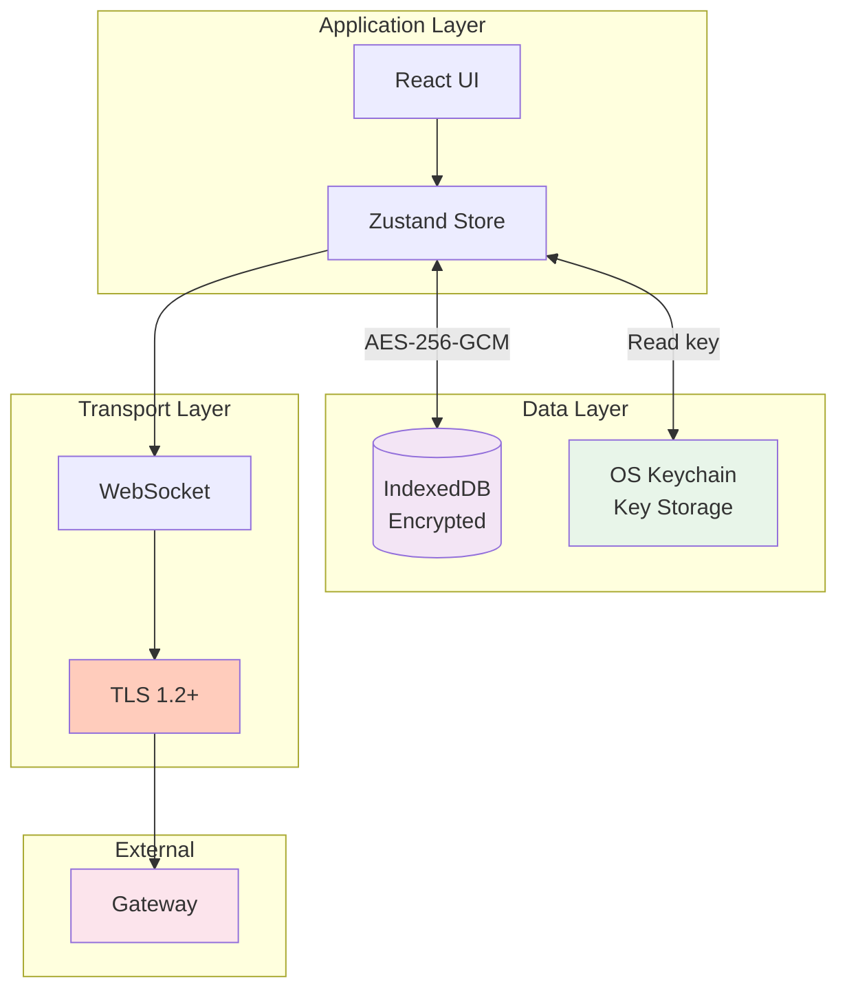

# Moltz Architecture Diagrams

Collection of architectural diagrams for Moltz.

---

## System Architecture

---

## Component Architecture

---

## Data Flow - User Sends Message

---

## State Management

---

## Connection State Machine

---

## Message Lifecycle

---

## Security Architecture

---

## Performance Optimization: Message Virtualization

---

## Deployment Architecture (Future Team Mode)

---

**See also:** [Architecture.md](../Architecture.md) for detailed explanations
